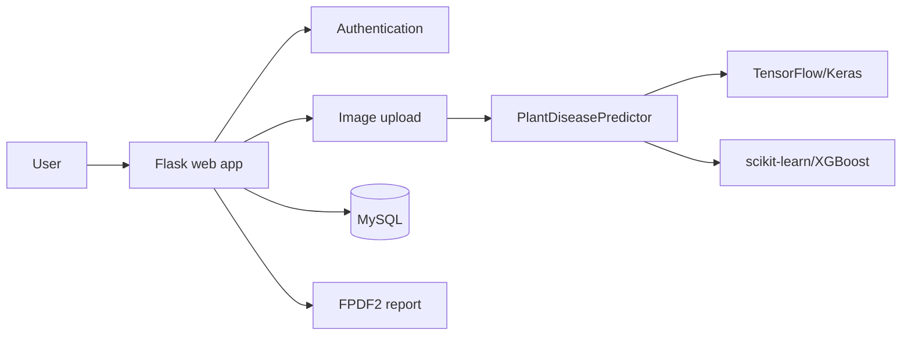

# 🌿 Visual Plant Disease Diagnosis Using AI

<p align="center">
  
</p>

<p align="center"><strong>AI-assisted plant disease screening from leaf images.</strong></p>

<p align="center">
  
  
  
  
</p>

## Overview

This Flask web application classifies plant leaf images using TensorFlow/Keras and scikit-learn/XGBoost models. It provides authentication, image upload, disease information, treatment guidance, prediction history, and downloadable PDF reports.

Developed by **Dhanush M** (`1NT23MC016`) for the MCA program at **Nitte Meenakshi Institute of Technology (NMIT), Bengaluru**, under the guidance of **Dr. Sreekanth R**.

> **Responsible use:** This is an academic screening tool, not a replacement for an agronomist or plant pathologist. Predictions depend on image quality and training data. Always follow local agricultural guidance and product labels.

## Realistic visual reference gallery

<p align="center">
  
  
</p>

<p align="center">
  
  
</p>

These are real agricultural photographs used for project presentation and visual context only. They are **not** training images, disease examples, ground truth, or model evaluation results. See the complete [visual gallery documentation](docs/visual-gallery.md).

## Features

- 🔐 Registration and login with bcrypt password hashing
- 📸 JPG, JPEG, PNG, WEBP, and BMP image upload support
- 🤖 Deep-learning and classical machine-learning model selection
- 📊 Prediction class and confidence score display
- 🌱 Causes, symptoms, organic remedies, chemical guidance, and prevention tips
- 📜 User-scoped prediction history in MySQL
- 📄 Downloadable PDF diagnosis reports
- 📱 Responsive Bootstrap interface with drag-and-drop preview

## AI models

| Category | Models | Processing |
|---|---|---|
| Deep learning | MobileNet, Custom CNN, VGG16, VGG19 | 224 × 224 RGB images with TensorFlow/Keras |
| Machine learning | SVM, Random Forest, Decision Tree, XGBoost | Flattened normalized image features |

The class-index mapping is maintained in [`utils/model_utils.py`](utils/model_utils.py). Accuracy numbers should only be published with their dataset split, evaluation method, and experiment artifacts; validation metrics are not calculated by the web app at runtime.

## Supported dataset classes

The predictor uses the PlantVillage class mapping defined in `utils/model_utils.py`, covering healthy and diseased leaves from crops including apple, blueberry, cherry, corn, grape, orange, peach, pepper, potato, raspberry, soybean, squash, strawberry, and tomato.

## Architecture



## Project structure

```text
plant-disease-detection/
├── app.py                 # Flask routes, authentication, diagnosis, reports
├── requirements.txt       # Python dependencies
├── database/schema.sql    # MySQL schema and disease data
├── models/                # Local .h5/.joblib artifacts; gitignored
├── utils/model_utils.py   # Model discovery and inference
├── templates/             # Jinja2 pages
├── static/css/            # Application styles
├── static/js/             # Browser behavior
├── static/uploads/        # Runtime uploads; gitignored
├── reports/               # Generated PDFs; gitignored
└── docs/                  # Architecture and visual documentation
```

## Setup

### Prerequisites

- Python 3.10+
- MySQL 8.0+ or XAMPP
- Git
- Trained model files for real predictions

### Install and run

```bash
git clone https://github.com/dhanushmaranii2604/plant-disease-detection.git
cd plant-disease-detection
python -m venv .venv

# Windows PowerShell
.venv\Scripts\Activate.ps1
# macOS/Linux
source .venv/bin/activate

python -m pip install --upgrade pip
pip install -r requirements.txt
mysql -u root -p < database/schema.sql
python app.py
```

Open <http://127.0.0.1:5000>.

Place trained artifacts in `models/` using the names expected by `utils/model_utils.py`. The application can start without model files, but diagnosis requires at least one compatible model.

## Configuration

The application reads these environment variables:

| Variable | Default | Purpose |
|---|---|---|
| `SECRET_KEY` | development fallback | Flask session signing; set a strong production value |
| `DB_HOST` | `localhost` | MySQL host |
| `DB_USER` | `root` | MySQL user |
| `DB_PASSWORD` | empty | MySQL password |
| `DB_NAME` | `plant_disease_db` | Database name |

## Typical workflow

1. Register and sign in.
2. Open **Diagnose** and choose an available model.
3. Upload a clear, well-lit leaf image.
4. Review the prediction and disease guidance.
5. Download a PDF report or revisit the result in **History**.

## Security and deployment notes

Before production deployment:

- Set a strong `SECRET_KEY` through the environment.
- Disable Flask debug mode.
- Add CSRF protection to POST forms.
- Validate actual image content, not only file extensions.
- Use UUID-based filenames and a least-privilege database user.
- Do not expose raw database exceptions to users.
- Run behind Gunicorn or Waitress with HTTPS.

## Documentation

- [Architecture and deployment notes](docs/architecture.md)
- [Reference images](docs/reference-images.md)
- [Realistic visual gallery](docs/visual-gallery.md)

## References

- [PlantVillage dataset](https://www.kaggle.com/emmarex/plantdisease)
- Mohanty, Hughes, and Salathé (2016), *Using deep learning for image-based plant disease detection*, Frontiers in Plant Science.
- Howard et al. (2017), *MobileNets*, arXiv:1704.04861.

## Academic project

This project was developed for academic purposes as part of the MCA degree requirements at NMIT, Bengaluru, during the 2024–2025 academic year.
