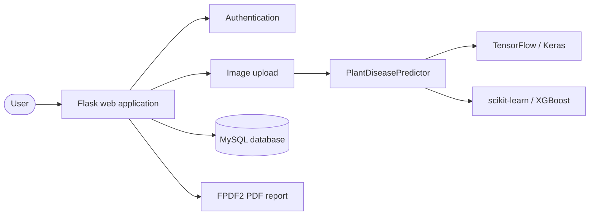

# 🌿 Visual Plant Disease Diagnosis Using AI

<p align="center">
  
</p>

<p align="center"><strong>AI-assisted plant disease screening from leaf images.</strong></p>

<p align="center">
  
  
  
  
</p>

<p align="center">
  <a href="#overview">Overview</a> •
  <a href="#features">Features</a> •
  <a href="#architecture">Architecture</a> •
  <a href="#setup">Setup</a> •
  <a href="#documentation">Documentation</a>
</p>

## Overview

**Visual Plant Disease Diagnosis Using AI** is a Flask-based web application that analyzes plant leaf images and provides AI-assisted disease screening. The application combines TensorFlow/Keras deep-learning models with classical machine-learning models and presents results with supporting disease information and treatment guidance.

The platform includes:

- User registration and authentication
- Leaf image upload and preview
- Multiple model options for prediction
- Disease information and prevention guidance
- User-scoped prediction history
- Downloadable PDF diagnosis reports

> **Responsible use:** This academic project is a screening aid and is not a replacement for a qualified agronomist or plant pathologist. Results depend on image quality, training data, and model performance. Always follow local agricultural guidance and product labels.

### Project information

| Detail | Information |
|---|---|
| **Developer** | Dhanush M (`1NT23MC016`) |
| **Program** | Master of Computer Applications (MCA) |
| **Institution** | Nitte Meenakshi Institute of Technology (NMIT), Bengaluru |
| **Guide** | Dr. Sreekanth R |
| **Academic year** | 2024–2025 |

## Plant disease reference images

<p align="center">
  
  
</p>

<p align="center">
  <em>Real disease reference photographs shown for project presentation and visual context only. They are not training images, ground truth, or model evaluation results.</em>
</p>

- [Tomato late blight image source](https://commons.wikimedia.org/wiki/File:Late_blight_on_tomato_leaves_01.jpg)
- [Grape downy mildew image source](https://commons.wikimedia.org/wiki/File:Downy_mildew_grape_2.JPG)

## Features

- 🔐 **Authentication** — Registration and login with bcrypt password hashing
- 📸 **Image upload** — Supports JPG, JPEG, PNG, WEBP, and BMP files
- 🤖 **Model selection** — Choose between deep-learning and classical machine-learning models
- 📊 **Prediction results** — View the predicted class and confidence score
- 🌱 **Disease guidance** — Review causes, symptoms, organic remedies, chemical guidance, and prevention tips
- 📜 **Prediction history** — Access user-specific results stored in MySQL
- 📄 **PDF reports** — Download diagnosis reports for individual predictions
- 📱 **Responsive interface** — Bootstrap-based UI with drag-and-drop image preview

## AI models

| Category | Available models | Input / processing |
|---|---|---|
| **Deep learning** | MobileNet, Custom CNN, VGG16, VGG19 | 224 × 224 RGB images processed with TensorFlow/Keras |
| **Machine learning** | SVM, Random Forest, Decision Tree, XGBoost | Flattened and normalized image features |

The class-index mapping is maintained in [`utils/model_utils.py`](utils/model_utils.py). Accuracy figures should only be reported together with the dataset split, evaluation method, and experiment artifacts. The web application does not calculate validation metrics at runtime.

## Supported dataset classes

The predictor uses the PlantVillage class mapping defined in [`utils/model_utils.py`](utils/model_utils.py). The mapping covers healthy and diseased leaves from crops including:

**Apple · Blueberry · Cherry · Corn · Grape · Orange · Peach · Pepper · Potato · Raspberry · Soybean · Squash · Strawberry · Tomato**

## Architecture



## Project structure

```text
plant-disease-detection/
├── app.py                    # Flask routes, authentication, diagnosis, and reports
├── requirements.txt          # Python dependencies
├── database/
│   └── schema.sql            # MySQL schema and disease data
├── models/                   # Local .h5/.joblib artifacts; gitignored
├── utils/
│   └── model_utils.py        # Model discovery and inference
├── templates/                # Jinja2 templates
├── static/
│   ├── css/                  # Application styles
│   ├── js/                   # Browser-side behavior
│   └── uploads/              # Runtime uploads; gitignored
├── reports/                  # Generated PDFs; gitignored
└── docs/                     # Architecture and visual documentation
```

## Setup

### Prerequisites

- Python 3.10 or later
- MySQL 8.0 or XAMPP
- Git
- Trained model files for real predictions

### Installation

```bash
git clone https://github.com/dhanushmaranii2604/plant-disease-detection.git
cd plant-disease-detection
python -m venv .venv
```

Activate the virtual environment:

```powershell
# Windows PowerShell
.venv\Scripts\Activate.ps1
```

```bash
# macOS / Linux
source .venv/bin/activate
```

Install the dependencies and initialize the database:

```bash
python -m pip install --upgrade pip
pip install -r requirements.txt
mysql -u root -p < database/schema.sql
```

Start the application:

```bash
python app.py
```

Open <http://127.0.0.1:5000> in your browser.

> **Model files:** Place compatible trained artifacts in `models/` using the filenames expected by [`utils/model_utils.py`](utils/model_utils.py). The application can start without model files, but diagnosis requires at least one compatible model.

## Configuration

The application reads the following environment variables:

| Variable | Default | Description |
|---|---|---|
| `SECRET_KEY` | Development fallback | Flask session signing key; use a strong production value |
| `DB_HOST` | `localhost` | MySQL host |
| `DB_USER` | `root` | MySQL username |
| `DB_PASSWORD` | Empty | MySQL password |
| `DB_NAME` | `plant_disease_db` | Database name |

## Typical workflow

1. Register and sign in.
2. Open **Diagnose** and choose an available model.
3. Upload a clear, well-lit image of a plant leaf.
4. Review the prediction and disease guidance.
5. Download a PDF report or revisit the result in **History**.

## Security and deployment checklist

Before deploying to production:

- Set a strong `SECRET_KEY` through the environment.
- Disable Flask debug mode.
- Add CSRF protection to all POST forms.
- Validate actual image content, not only file extensions.
- Use UUID-based filenames for uploaded files.
- Use a least-privilege database user.
- Avoid exposing raw database exceptions to end users.
- Run behind Gunicorn or Waitress with HTTPS.

## Documentation

- [Architecture and deployment notes](docs/architecture.md)
- [Reference images](docs/reference-images.md)
- [Visual gallery](docs/visual-gallery.md)

## References

- [PlantVillage dataset](https://www.kaggle.com/emmarex/plantdisease)
- Mohanty, Hughes, and Salathé (2016), *Using deep learning for image-based plant disease detection*, Frontiers in Plant Science.
- Howard et al. (2017), *MobileNets*, arXiv:1704.04861.

## Academic project

This project was developed for academic purposes as part of the MCA degree requirements at NMIT, Bengaluru, during the 2024–2025 academic year.
